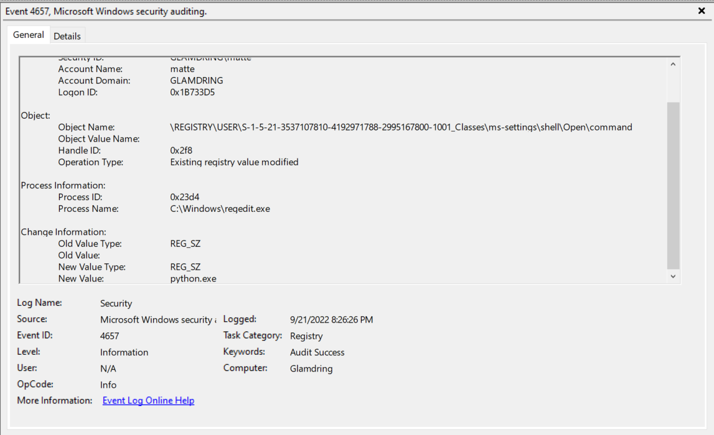
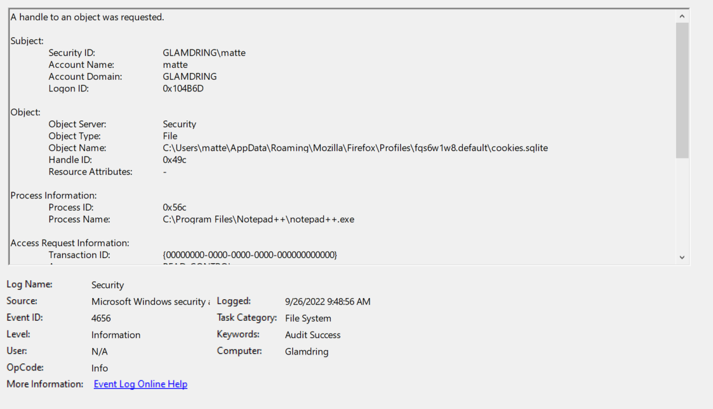
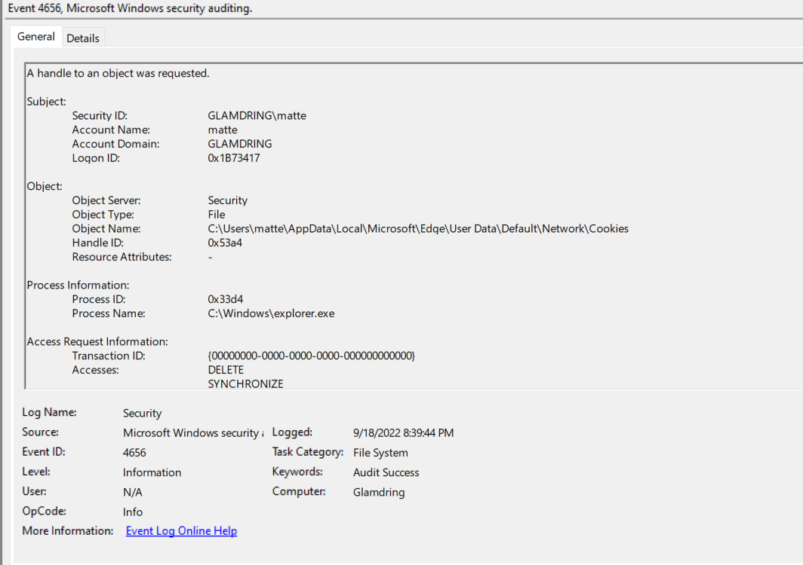
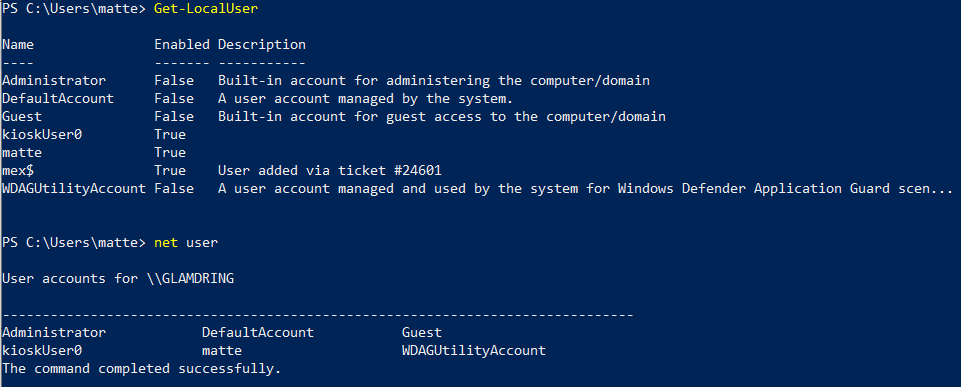

# Client Side IOC Detection
The following guide is intended to cover Windows auditing which can detect the indicators of compromise generated by TheAllCommander
## Fodhelper - "spawn_fodhelper_elevated_session" - macro
Fodhelper UAC Bypass is often intercepted by Windows defender, but not always. Writes to this registry key are often still permitted and the UAC allowed. Therefore, monitoring attempts to elevate in this manner are helpful.
The attack relies on the user setting the value of the HKCU:\Software\Classes\ms-settings\Shell\Open\command registry key. Therefore, one way to detect this attack is to observe setting the value of this registry key. Since it appears very rare that legitimate applications and business workflows will need to set this value, this indicator will usually work reliably.

1) Enable Audit object access "Success and Failure" for the system under the group policy

2) Enable Auditing of "Set Value" on the key directly or one of its parent keys

3) Filter for

	Windows Event ID == 4657 AND
	
	Object Name LIKE \REGISTRY\USER\"ID regular expression"_Classes\ms-settings\Shell\Open\command
	

## CMSTP UAC Bypass
Since this UAC bypass presents a visible "blip" on the screen, many defensive solutions don't consider it to be a threat. However, given that it can be triggered so quickly that the human eye can't follow the text, there is still a clear threat. 

Recommendation: cmstp.exe will not usually run on end-user systems. MITRE recommends disabling it on endpoints if possible. If it cannot be removed, your SIEM should be set up to monitor if it is invoked, and what arguments are selected. (https://attack.mitre.org/techniques/T1218/003/). In addition to recommending comparison of cmstp invocation against prior logs like MITRE does, I would suggest explicit whitelisting of known good configurations for cmstp to be using. Since the purpose of cmstp is to push configurations out, theoretically those configurations have gone through configuration management review and are baselined to be used in a production environment. 

## SDCLT Registry Key UAC Bypass
This UAC bypass utilizes the HKCU\Software\Classes\Folder\shell\opens\command registry key by writing a an executable command which is launched in place of sdclt as high integrity. Windows Defender monitors this registry key, and as of Windows 11 any commands that include cmd.exe or python will be blocked. However, testing has shown that other executables like calc.exe are flagged as potentially harmful, and yet Defender lets them through. However, Defender (as of August 2024) will then quickly stop a spawned new process. Yet, if that process, before Defender stops it, spawns another process, that child process is allowed to roam free without any prevention. This was reported to Microsft (MSRC Case 90284), and their response was "After careful investigation, this case does not meet MSRCs current bar for immediate servicing because the reported behavior does not cross any recognized MSRC security boundaries." While hopefully there will be a patch to address this at some point, in the meantime defenders should be vigilant and monitor for abuse of this registry key. 

Therefore, the attack chain that we want to monitor looks like this: First, and attacker will write an executable to the registry key shown above. sdclt is then invoked, and the malicious process is opened. The malicious process then immediately spawns another copy of itself and is allowed to proceed. 

Recommendation: In addition to paying attention to Windows Defender's own events, a SIEM should monitor any writes to this registry key and flag any modifications as a strong IOC. If possible, endpoint protection software should be configured to automatically shutdown any processes spawned by sdclt invocation after this registry key write, as well as any child processes that result. 

Reference: http://blog.sevagas.com/?Yet-another-sdclt-UAC-bypass

## Event Viewer Registry UAC Bypass

The registry key HKCU\software\classes\mscfile\shell\open\command can be written to spawn a different process when a user attempts to load Event Viewer. In Windows 10, this resulted in a process with elevated integrity. Testing on Windows 11 indicates that a process will not inherit elevated integrity, however this registry key should still be monitored, as attempted writes are an indicator that someone is up to no good. 

1) Enable Audit object access "Success and Failure" for the system under the group policy

2) Enable Auditing of "Set Value" on the key directly or one of its parent keys

3) Filter for

	Windows Event ID == 4657 AND
	
	Object Name LIKE software\classes\mscfile\shell\open\command

## Cookie Harvest - "harvest_cookies" - macro
Two Windows events are helpful for detecting access for cookies. 4656 is generated when a process requests access to an object, and 4663 is generated when the process actually accesses the object. Turning on this sort of auditing is excessively noisy unless very finely calibrated, as there is the potential to log every time that any process accesses any file or object. This will overwhelm most storage systems quickly, and SIEM license caps can be exceeded quickly. These instructions are calibrated to audit only the files specifically used for cookies.

1) Enable Audit object access "Success and Failure" for the system under the group policy

2) Enable Auditing of "Read" on the cookie files for the browser being used

3) Filter for
 
	Windows Event ID == 4656 OR 4663 AND
	
	Object Name == "target cookie file" AND
	
	Process Name != "target browser" AND
	
	Process Name != "your backup software solution"
	
	
## Outlook Harvest - "harvest_outlook" - macro
Outlook files are stored as .pst and .ost, both of which can be read to grab stored emails. Similar logic can be used to identify compromise of these files as we used with browser cookies.

1) Enable Audit object access "Success and Failure" for the system under the group policy

2) Enable Auditing of "Read" on the system's Outlook folders

3) Filter for
 
	Windows Event ID == 4656 OR 4663 AND

	Object Name LIKE *.pst OR LIKE *.ost AND

	Process Name != Outlook AND

	Process Name != "backup software solution"

## Cookie Deletion  - "delete_cookies" - macro
1) Enable Audit object access "Success and Failure" for the system under the group policy

2) Enable auditing for file deletion on the browser cookie files

3) Filter for:

	Windows Event ID == 4656 AND

	Process Name != "Expected browser" AND

	Accesses INCLUDES "DELETE"

## Empty Recycle Bin - "empty_recycle_bin" - macro
Attackers remove items from the recycle to cover their tracks in a variety of ways. One of the most simple and efficient ways of doing is to delete the %systemdrive%\$Recycle.Bin folder. This method also will not usually be employed by legitimate applications. To that end, it's worth checking for deletions of this folder. 
At this time, I can only offer a modest fidelity detection which will detect the specific implementation chosen by TheAllCommander, but there are other techniques for deleting the folder which are not detected by this technique.

1) Enable auditing of processes

2) Enable logging of command line for process creation

3) Filter for:

	Windows Event ID = 4688

	Process Command Line LIKE "del 'regular expression for spaces and arguments' $Recycle.Bin"

## Enumerate Users - "enumerate_users" - macro
TheAllCommander uses the net command to enumerate users in a very simplistic enumeration strategy. The technique for monitoring for use of the net command for enumeration with the following rule requires that only a manageable pool of system administrators are using net for managing the user base. If the rights to perform these functions are permitted for nominal users, then this technique generates false notifications.
Please note that net can be executed as net or net1, as net simply invokes net1. Rules that are tied simply to net.exe will fail with the simple bypass of invoking net1.

1) Enable auditing of processes

2) Enable logging of command line for process creation

3) Filter for:

	Windows Event ID = 4688

	Process Command Line LIKE "net.exe *" OR "net1.exe *" OR "net *" OR "net1 *"
	
To augment this technique, it is wise to create a honeypot user account that no one has a real business reason to be accessing. Enable the account with an impossible password and no permissions to anything. 

1) Enable Audit Successful Directory Service Access

2) Under "Auditing", enable auditing for "Full Control" for the honeypot user

3) Filter for:

	Windows Event ID = 4662

	Account Name = 'your honeypot'
	
Any time anyone performs domain or system wide enumeration, such as with "net user /domain", the user will be accessed and 4662 will be generated. This can, of course, still happen with nominal housekeeping, but it is much more granular than trying to track all accesses of "net". It is also more comprehensive, as techniques which bypass net to enumerate users will still be captured.

## Windows Startup Key - "regkey_persist" macro
The Windows registry contains keys which will start programs automatically on startup. Attackers will sometimes add programs to these registry keys to allow malware to start. Malicious entries can often be detected trivially with visual inspection. On a regular system baseline, these registry values should not be modified frequently and can be monitored for modification. These key are:

HKCU:\Software\Microsoft\Windows\CurrentVersion\Run

HKLM:\Software\Microsoft\Windows\CurrentVersion\Run

1) Enable Audit object access "Success and Failure" for the system under the group policy

2) Enable Auditing of "Set Value" on the key directly or one of its parent keys

3) Filter for

	Windows Event ID == 4657 AND
	
	Object Name LIKE 'each of the registry keys shown above'

## Windows Debug Key - "reg_debugger" macro
HKLM\SOFTWARE\Microsoft\Windows NT\CurrentVersion\Image File Execution Options\<process name> can be given a "Debugger" key, which will launch the evil process instead of the desired one. The Image File Execution Options keys should not be modified regularly, so watching them for access changes is a reasonable IOC.

1) Enable Audit object access "Success and Failure" for the system under the group policy

2) Enable Auditing of "Set Value" on the key directly or one of its parent keys

3) Filter for

	Windows Event ID == 4657 AND
	
	Object Name LIKE HKLM\SOFTWARE\Microsoft\Windows NT\CurrentVersion\Image File Execution Options\*

## Windows Silent Exit Key - "reg_silent_exit" macro
Registry keys can be set to have a process silently launch when another process exits. This requires several keys to be written. In the provided example, calc.exe stands in for the evil process.

reg add "HKLM\SOFTWARE\Microsoft\Windows NT\CurrentVersion\Image File Execution Options\notepad.exe" /v GlobalFlag /t REG_DWORD /d 512
reg add "HKLM\SOFTWARE\Microsoft\Windows NT\CurrentVersion\SilentProcessExit\notepad.exe" /v ReportingMode /t REG_DWORD /d 1
reg add "HKLM\SOFTWARE\Microsoft\Windows NT\CurrentVersion\SilentProcessExit\notepad.exe" /v MonitorProcess /d "calc.exe"

For detection logic, the same filtering for "reg_debugger" can be applied to catch the first registry key write. The following logic can be applied to catch the latter two calls.

1) Enable Audit object access "Success and Failure" for the system under the group policy

2) Enable Auditing of "Set Value" on the key directly or one of its parent keys

3) Filter for

	Windows Event ID == 4657 AND
	
	Object Name LIKE HKLM\SOFTWARE\Microsoft\Windows NT\CurrentVersion\SilentProcessExit\*

## Hidden Users - "add_hidden_user" macro
Usernames will not show up in 'net user' checks when created in this manner, described in more detail in the primary README. However, PowerShell user enumeration can detect this obfuscation technique.

Find users:
Get-LocalUser

Remove the accounts: 
Remove-LocalUser -Name <paste>

## Enumeration

### Network Share Enumeration

The command used here simply uses WMIC to list the available shares. Microsoft has deprecated the stand alone WMIC executable and intends to migrate this command into Powershell for better control and monitoring. In the meantime, the wmic executable exists. In general, normal users have no use case to invoke wmic on a system. As such, if SIEM detects that a command:

1) Originates from a non-admin user AND

2) Invokes the "wmic" process 

This is a moderate confidence security event that should be investigated, particularly if other wmic invocations are implemented. Such detection is more challenging if an administrative user compromised as this sort of enumeration of a network is a nominal part of a system administrator's job.

### AntiVirus Enumeration

There are several techniques for enumerating antivirus. One of which is to use a command such as "wmic /namespace:\\root\SecurityCenter2 path AntiVirusProduct get * /value" to query WMIC. The same detection logic applies as for "Network Share Enumeration" - normal users should be invoking wmic, while system administrators will regularly using wmic to do things like check if antivirus is registred and enabled.  

### Windows Patch Enumeration

Patch levels can be enumerated through wmic, therefore the detection recommendations from "Network Share Enumeration" apply here as well. However, going a step beyond wmic, enumeration can also be accomplished via Powershell. To detect this, first that powershell commands are also being processed through the SIEM, as well as new processes launched. Apply the following rule to powershell commands processed. If...

1) Commandlet Equals-Ignores-Case get-hotfix AND

2) The user is a not a member of the system administrators group(s)

This is a low-moderate confidence IOC. While some normal users might just be curious if their system is patching correctly, or a administrative troubleshooter might be walking them through troubleshooting steps to restore patching, likely an indicator of enumeration.

### Windows User Enumeration

The most straightforward way for attackers to list users and groups for Windows is via the "net" command. As with WMIC, there really aren't many reasons normal reasons should use the "net" command, although some power users may use it to confirm their own group memberships. Therefore, the following rules are suggested. A command can be flagged for review if it:

1) Originates from a non-admin user AND

2) invokes the "net" or "net1" process.

Please note that net and net1 are synonymous in Windows, so checks for net.exe will miss any obfuscation attempts that use net1.exe

## LSASS Dump
### rundll32.exe C:\windows\System32\comsvcs.dll, MiniDump "LSASS PID" lsass.dmp full
This technique is blocked by default by Windows Defender easily, so we're not going to look at detection here
### ProcDump
This technique is blocked by default by Windows Defender easily, so we're not going to look at detection here

## Command obfuscation

### Powershell obfuscation

While there may be legitimate scripting reasons to echo commands into powershell, this technique should not be used in operations because it defeats logging and monitoring systems. Fortunately, the structure of the command is reliable; there is an echo, followed by text, followed by powershell. While the following regular expression should not be considered definitive, it is one possible regular expression that be used as a rule to flag commands for review: "(*)+echo (*)+|(*)+powershell(*)+". The extra "catch 0 or more characters of any type as represented by (*)+ occur in any potential breaks in the command to catch possible junk characters or attempts at misdirection.   

### Windows Command Line obfuscation

Analyzing this technique has a relatively straightforward solution. Because the "^" command can be easily filtered for, a SIEM pre-processing rule can be implemented that first eliminates all "^" characters from the processing of later rules. For example, before checking that a command matches the pattern "net user *", first apply a regular expression that eliminates "^" characters. However, to make sure that edge cases are considered, the ruleset should also be processed against the original command string. This is because, if there should be a "^" as part of an IOC elsewhere in the ruleset, it will not be eliminated. While this does have a substantial impact on the processing time of all rules that are processed against command line instruction, such events usually do not occur at such a volume as to overwhelm the computing power of a system. Weighed against the risk of allowing a threat actor to so easily bypass malicious command recognition, this rule or a similar rule should be implemented.  

#SIEM Translation
Transitioning between SIEM systems? I've experimented a bit with this translator: https://uncoder.io/